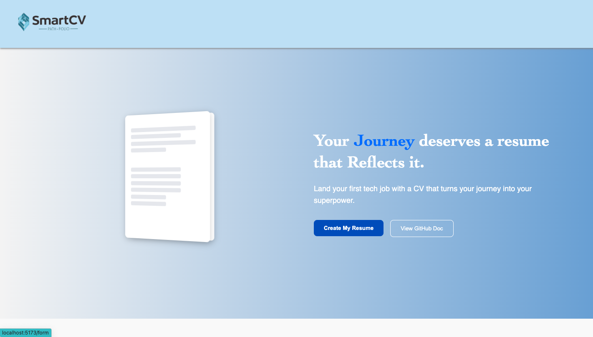
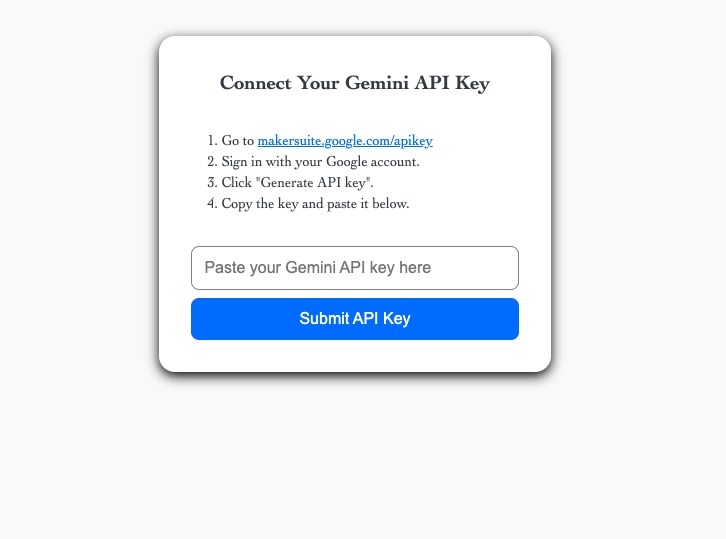
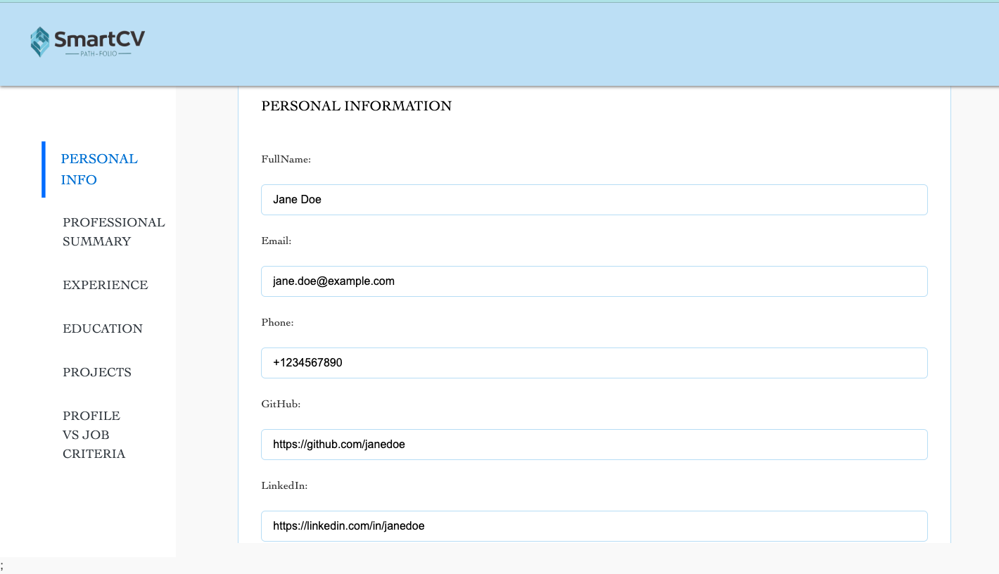
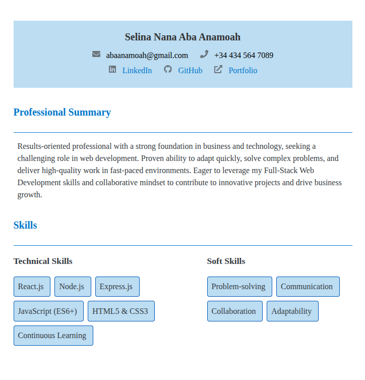
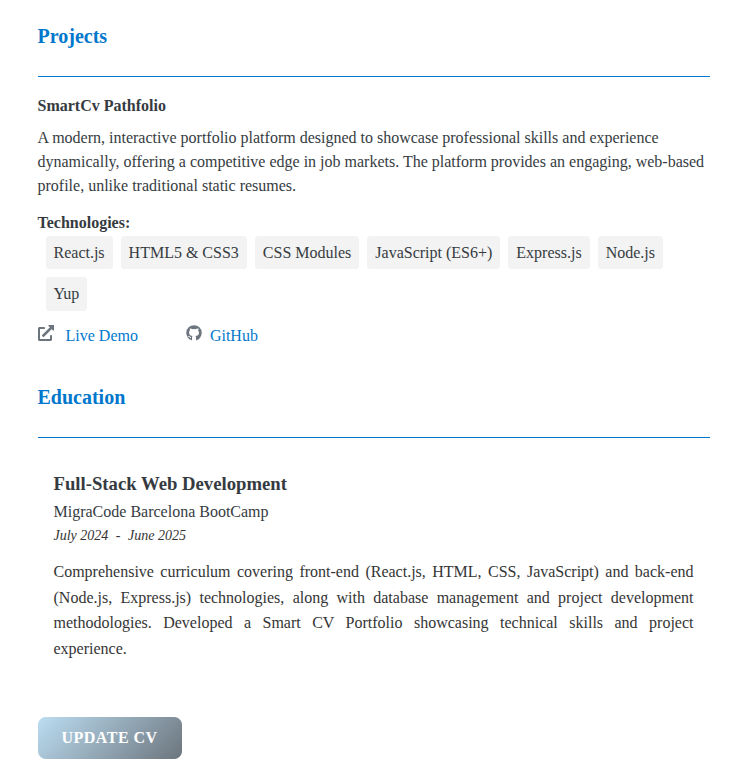
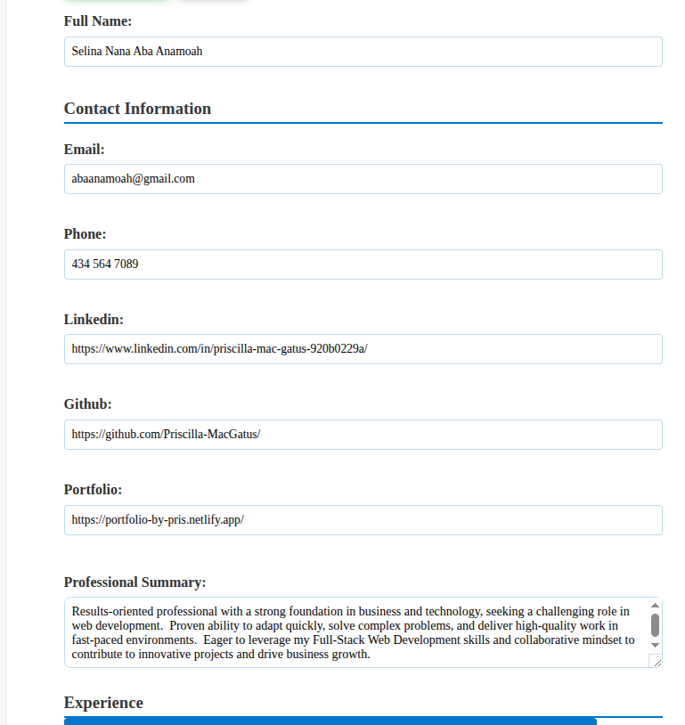
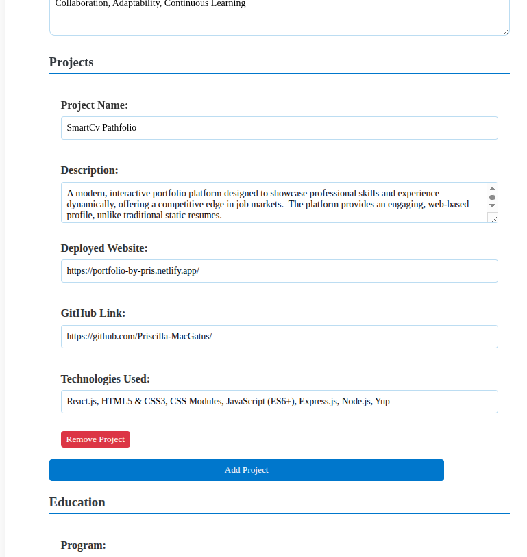

# AI CV Generator (Full Stack App)

The Smart CV Path-folio is a resume-building tool designed to support non-traditional tech professionals such as self-taught developers, bootcamp graduates, and career switchers. It helps them create impactful, professional CVs that stand out. Unlike standard resume generators, this app uses AI to tailor resumes for unconventional career journeys while ensuring compatibility with Applicant Tracking Systems (ATS).Built as a full-stack application, it combines a React frontend with a Node.js backend, integrating Google's Gemini AI to generate polished, job-specific CV content.

---

## Why This Matters

Many non-traditional job seekers struggle to present their unique skills and experiences in traditional CV formats. Standard resume tools often fail to capture the nuances of career switchers or self-taught developers. By leveraging AI, this app provides personalized resume enhancements that improve ATS compatibility and recruiter readability, increasing chances of landing interviews.

## How to Use the App — User Flow Overview

**API Key Entry**
Users start by entering their Google Gemini API key, which unlocks access to the resume builder form. The key is validated and saved locally.

**Multi-Step Form**
Users fill out detailed sections through a multi-step form, including:

- Personal Information
- Professional Summary
- Transferable Experience
- Education
- Projects
- Profile vs Job Matching
- The form is controlled and saves progress automatically to localStorage to prevent data loss.

**AI-Enhanced CV Generation**
Once submitted, the data is sent to the backend where the Gemini AI analyzes it and returns an enhanced version. This version refines summaries, aligns experience with job descriptions, and optimizes content for ATS.

**CV Preview and Editing**
The enhanced CV is displayed in a preview component with editable fields. Users can tweak or expand the AI-generated content as needed.

**Download as PDF**
Finally, users can download a polished PDF version of their CV, ready to submit for job applications.

## How to Use the App — User Flow Overview






- The landing page provides a seamless starting point for users. It introduces the CV builder with minimal distractions, allowing self-taught developers, bootcamp grads, and career switchers to dive straight into their resume journey.

- API Key EntryUsers start by entering their Google Gemini API key, which unlocks access to the resume builder form. The key is validated and saved locally.

- Multi-Step FormUsers fill out detailed sections through a multi-step form, including:

  - Personal Information
  - Professional Summary
  - Transferable Experience
  - Education
  - Projects
  - Profile vs Job Matching

**The form is controlled and saves progress automatically to localStorage to prevent data loss.**

- AI-Enhanced CV Generation
- Once submitted, the data is sent to the backend where the Gemini AI analyzes it and returns an enhanced version. This version refines summaries, aligns experience with job descriptions, and optimizes content for ATS.

- CV Preview and Editing






**The enhanced CV is displayed in a preview component with editable fields. Users can tweak or expand the AI-generated content as needed.**

- Download as PDF
  Finally, users can download a polished PDF version of their CV, ready to submit for job applications.

## Tech Stack

- Frontend: React, CSS Modules
- Backend: Netlify Serverless Functions, Node.js
- AI Integration: Google Gemini AI
- Validation: Yup

## Project Structure

```js
src/
├── netlify/
| ├── utils/
│  └── validations.js
|  └──date.js
| ├── functions
|  └──enhanceWithAi.mts
|  └── generateCv.mts
├── components/
│ ├── Button/
│ ├── CharacterCount/
│ ├── Education/
│ ├── ErrorState/
│ ├── Header/
│ ├── IconSlide/
│ ├── LeftPane/
│ ├── LoadingState/
│ ├── MultiFormPage/
│ ├── PersonalInfo/
│ ├── ProfessionalSummary/
│ ├── ProfileVsJob/
│ ├── Project/
│ └── TransferableExperience/
| └──CvPreview/
├── hooks/
│ └── useSubmitPersonalInfo.js
├── utils/
│ └── date.js
| └──saveData.js
├── pages/
|└──PreviewPage/
README.md
```

---

## Features

### Frontend (React)

- Gemini API key authentication
- Multi-step form with auto-save to `localStorage`
- Real-time controlled inputs for:
  - Personal Info
  - Professional Summary
  - Transferable Experience
  - Education
  - Projects
  - Profile vs Job Matching
- AI-enhanced CV generation
- Sidebar with progress tracking

---

## How It Works (User Flow)

- The user enters a Gemini API key to unlock the CV form
- The key is validated and saved to localStorage
- User fills out a multi-step form guided by a LeftPane and IconSlider
- Progress is auto-saved to localStorage to avoid data loss
- On form submission, data is validated and sent to the backend
- Gemini AI processes the CV data and returns an enhanced version
- The enhanced CV is displayed with editable functionality so users can refine or expand on the AI-generated content
- A PDF version of the CV is generated and available for download, ready to be used in job applications

---

## Serverless Function: generateCv

The generateCv function is a Netlify serverless function that powers the AI-enhanced CV creation process. It acts as the backend endpoint for your application and is responsible for validating the submitted form data, preparing the input for Gemini AI, and returning an optimized CV.

## Location

```js
/netlify/functions/generateCv.mts
```

## What It Does

**1.Validates Incoming Data:**

- Uses yup to validate all submitted resume fields.
- Ensures required fields like full name, email, experience, projects, and education are present and formatted correctly.
- Validates the Gemini API key format and checks date fields like startDate and endDate.

**2.Prepares AI Payload:**

- Extracts relevant form data into a clean aiInput object.
- Converts jobcriteria into a structured list of skills.
- Ensures all resume sections (experience, projects, education) are sent in a consistent format.

**3.Calls the Gemini AI**

- Sends the formatted data to the enhanceWithAi() function.
- This uses the Google Gemini API to enhance the user's CV content (e.g., rewriting summaries, improving project descriptions, aligning experience with job requirements).

**4.Returns Response:**

- On success: returns a 200 OK response with the AI-enhanced CV.
- On validation error: returns a 400 Bad Request with detailed field errors.
- On server error: returns a 500 Internal Server Error with diagnostic information.

## Sample Payload

```js
{
  "apiKey": "AIza...your-valid-key...",
  "personalInfo": {
    "fullName": "Jane Doe",
    "email": "jane@example.com",
    "phone": "123-456-7890",
    "github": "https://github.com/janedoe",
    "linkedin": "https://linkedin.com/in/janedoe",
    "portfolio": "https://janedoe.dev"
  },
  "professionalSummary": {
    "summary": "Aspiring front-end developer with strong design skills..."
  },
  "transferableExperience": {
    "experience": "Worked as a teacher for 5 years and built educational tools..."
  },
  "projects": [
    {
      "name": "Smart Budget App",
      "description": "A React-based budgeting tool that helps users track expenses...",
      "deployedWebsite": "https://smartbudget.dev",
      "githubLink": "https://github.com/janedoe/smart-budget"
    }
  ],
  "education": [
    {
      "institution": "Code Bootcamp",
      "program": "Full Stack Web Development",
      "startDate": "January 2022",
      "endDate": "June 2022"
    }
  ],
  "profileVsJobCriteria": {
    "jobcriteria": "React, TypeScript, Tailwind, testing, API integration"
  }
}
```

## Example API Key Validation

This function checks whether the entered Gemini API key is in the correct format. Gemini API keys typically follow a specific pattern (starting with AIza and followed by 35 alphanumeric or dash/underscore characters).

```js
const validateApiKey = (key) => {
  const trimmedKey = key.trim();
  return /^AIza[0-9A-Za-z-_]{35}$/.test(trimmedKey);
};
```

## Sample Success Response

```js
{
  "msg": "CV generated successfully",
  "CV": {
    "fullName": "Jane Doe",
    "professional_summary": "Enthusiastic frontend developer with a strong background...",
    "experience": [...],
    "projects": [...],
    "education": [...],
    "skills": ["React", "TypeScript", "API Integration", ...]
  }
}
```

## Dependencies

- yup — schema-based form validation
- enhanceWithAi.mts — wrapper for Google Gemini AI calls
- Custom utilities:
  - /utils/validations.js – API key and string checks
  - /utils/date.js – start/end date format and comparison

## AI-Powered CV Enhancement Module

### **Overview**

This module uses **Google's Gemini AI** to analyze and improve the user's resume. It prioritizes:

- ATS (Applicant Tracking System) compatibility
- Recruiter readability
- Custom alignment with job descriptions

### **Key Features**

- Professional summary optimization
- Skills extraction and prioritization
- Transferable experience reframing
- Education and project enhancement
- Job criteria alignment analysis

---

## Module Components

### 1. Environment Configuration

```js
import { GoogleGenerativeAI } from '@google/generative-ai';
import dotenv from 'dotenv';
dotenv.config();
```

### 2.Core Function

This function sends user-provided CV data to the Gemini AI model to generate an enhanced version tailored for job applications. It takes in structured input from the form, such as education, experience, skills, and a comparison between the user's profile and job criteria and returns improved content suggestions, summaries, or rewrites.

```js
const enhanceWithAi = async ({
  professionalSummary,
  education,
  experience,
  projects,
  skills,
  profileVsJobCriteria,
}) => {
  // Implementation...
};
```

### 4.Prompt Engineering

**Includes:**

- AI role: Expert resume writer
- Data structure expectations
- Section-specific enhancement rules
- Output format (JSON)

### 5. Response Cleaning

When interacting with Gemini AI, responses may be returned in a Markdown code block format like:

```json
{
  "key": "value"
}
```

To ensure clean, usable output, especially for parsing or displaying in the UI, we strip out the Markdown formatting from the response:

```js
const responseText = result.response.text();
const cleanedResponse = responseText
  .replace(/`json\n?/g, '')
  .replace(/`\n?/g, '')
  .trim();
```

This leaves you with a clean string that can be safely parsed with JSON.parse() or used in your application.

### 6. Error Handling

- Logs Gemini API errors
- Handles bad or missing responses
- Validates response format (JSON)

### **Usage Example**

Use the `enhanceWithAi` function to send structured CV data to Gemini AI and receive an enhanced version. This includes refining summaries, aligning experiences with job criteria, and enriching project descriptions.

[View function definition →](https://github.com/SyedArslanHaider/smart-cv-builder/blob/1a910ed4e982c3529e616a71e720aa35be882560/api/src/controllers/generateCv.js#L124-L136)

### Dependencies

- yup – Data validation
- React,CSS – Frontend styling and UI

## CVPreview

The CVPreview component is a comprehensive React component that allows users to view, edit, and download their CV/resume. It supports two modes:

- **Preview mode:** Read-only display of the CV
- **Edit mode:** Full form controls for editing all CV sections

### Key Features

- Data Parsing: Handles stringified JSON, multiple formats, legacy field names, and different skill formats.
- Edit Mode: Toggle view/edit modes, dynamic addition/removal of array items, real-time bullet point editing.
- Printing Support: Uses react-to-print with print-specific styling.
- Validation & Fallbacks: Handles missing data gracefully, provides defaults, shows empty state messages.

## Component Props

| Prop Name      | Type             | Description                                                   |
| -------------- | ---------------- | ------------------------------------------------------------- |
| `ref`          | React ref        | Forwarded ref used for printing functionality                 |
| `cvData`       | Object or String | The CV data to display or edit (can be JSON string or object) |
| `onSave`       | Function         | Callback fired when the user saves edited data                |
| `personalInfo` | Object           | Personal information data (name, contact, etc.)               |

## Expected Data Structure

```js
{
  fullName: String,
  contact: {
    email: String,
    phone: String,
    linkedin: String,
    github: String,
    portfolio: String
  },
  professional_summary: String,
  experience: [{
    companyName: String,
    jobTitle: String,
    startDate: String,
    endDate: String,
    bulletPoints: [String]
  }],
  projects: [{
    name: String,
    description: String,
    deployedWebsite: String,
    githubLink: String,
    technologiesUsed: [String]
  }],
  education: [{
    program: String,
    institution: String,
    duration: String,
    highlights: String
  }],
  skills: [String]
}
```

### Methods

| Method Name                                     | Description                                        |
| ----------------------------------------------- | -------------------------------------------------- |
| `parseCvData`                                   | Normalizes incoming CV data into consistent format |
| `handleInputChange`                             | Handles changes to top-level fields                |
| `handleArrayChange`                             | Manages changes to array fields                    |
| `handleBulletPointChange`                       | Handles editing bullet points within experience    |
| `addExperience` / `addProject` / `addEducation` | Adds new entries to respective arrays              |
| `removeItem`                                    | Removes entries dynamically                        |
| `handleSave` / `handleCancel`                   | Manages edit mode and save/cancel actions          |

### Styling

- Uses CSS Modules with classes:
- cv-container: Main container
- section: Styled sections
- form-group: Edit mode form groups

no-print: Elements hidden during printing

### **Full Stack Setup**

### Prerequisites

- Node.js v16+
- npm or yarn
- Google Gemini API Key [get one here](https://console.cloud.google.com/apis/credentials)
  Visit Google Cloud Console to create a new API key for Gemini.

### Frontend Setup (React)

- 1.Install dependencies:
  **npm install**
- 2.Start the frontend server:
  **npm run dev**
  ```js
  npm install
  npm run dev
  ```

### Testing App

- Start the frontend server:
  **npm start**
- Open the app at http://localhost:3000
- Enter your Gemini API key to unlock the form
